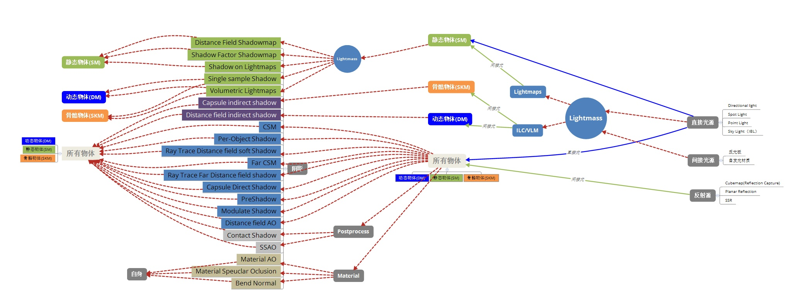
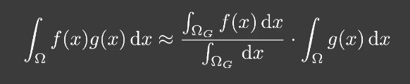
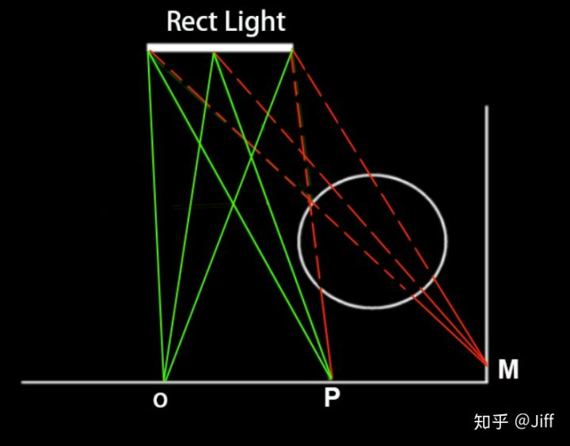
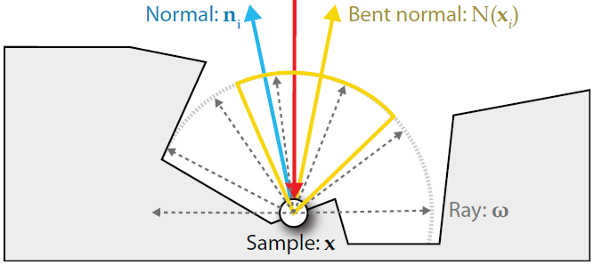
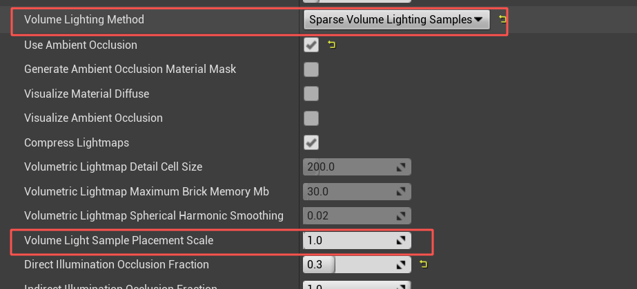
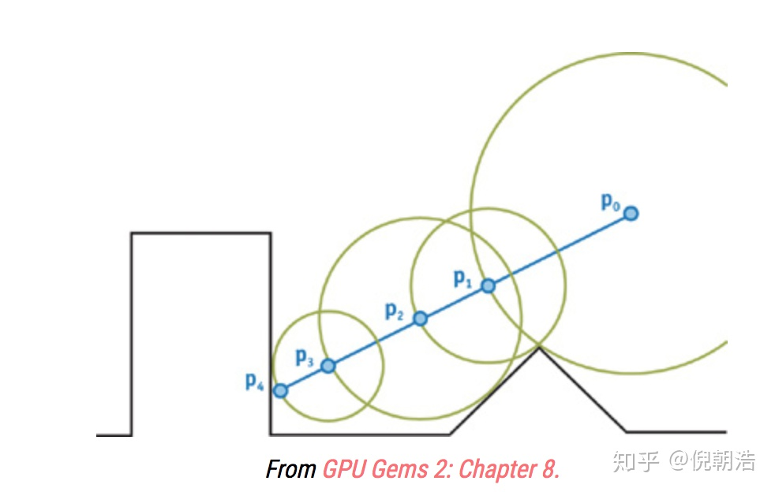
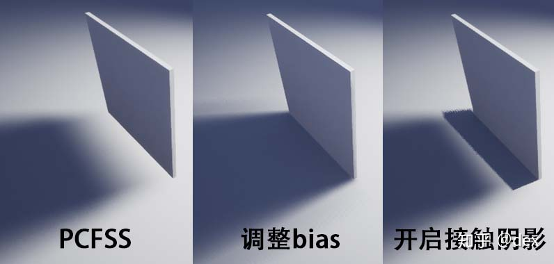
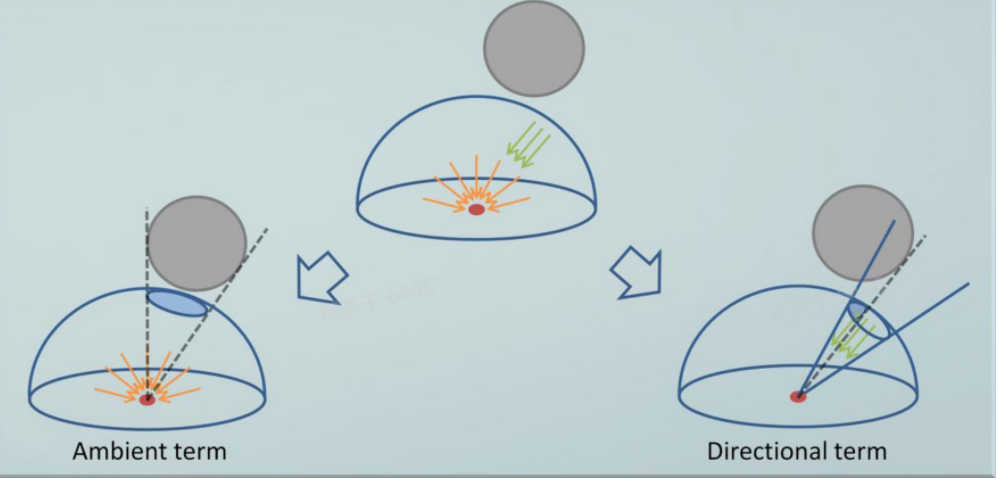
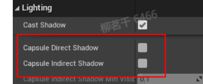

Lightmap烘焙




光深度好文：https://zhuanlan.zhihu.com/p/38125862

https://blog.ch-wind.com/ue4-lighting-and-optimize/

UE4中的所有光源通过lightmass和直接两种方式作用于物体。

## 光源种类

Movable和Stationary类型对物体产生直接光照明，Static类型灯光，自发光材质物体以及Stationary经过lightmass后会对物体产生间接光照明。反射也是一种间接光照明（动态天光产生的天光反射属于直接光）

UE4移动端间接照明主要来源于三个部分：天光 ，IBL(反射球等）和离线生成的光照图。其中天光和离线生成的光照图对应的是间接光照的Diffuse部分，而IBL则用于计算间接光照的Specular部分。

### 固定光照

光源亮度和颜色可以变化，但位置固定的光源（与静态的区别是静态啥都不能变化），不过运行时更改亮度仅更改直接照明，不会更改间接照明。可为静态物体烘焙光照和距离场阴影贴图。使用距离场阴影的话，即使光照贴图分辨率很低，也可以保持清晰。stationary light的动态物体使用逐物体阴影贴图，每一个光源每个物体都会渲染一个shadowmap，并合成一个atlas。动态阴影成本和动态阴影距离和动态对象数量相关。

影响一个网格的固定光照不能超过四个。

渲染比静态灯光昂贵，比全动态光照便宜

即使在定向光源上使用级联阴影贴图，可移动组件仍会创建PerObject阴影

### 动态光照

- 可以在场景中实时的创建和销毁，没有反射光，因此照射不到的地方是全黑。阴影非常锐利；可以快速迭代但是效果比静态光照差，有条件还是用静态好。
- 为整个场景动态投射阴影，性能成本很大。不过UE默认启用一个阴影贴图缓存功能，当灯不动时存储该灯的阴影贴图在下一帧重新使用。
- 成本取决于灯光效果和面片数量。
- 动态光源渲染cubemap shadowmap，使用一个geometry shader来选择要渲染到cubemap的哪个面上（以减少draw call）。
- 基本使用csm

### 静态光照

- 对于静态光，静态物体使用烘焙阴影，不对动态物体产生阴影。因此用途有限
- 阴影质量与光照贴图分辨率直接相关；
- 使用静态烘焙光照可以在场景中添加大量灯光而不增加运行时开销；
- 适用于微弱的远距离的光，动态光照效果更加强烈动感，静态光虽然有内存开销但效率高
- 静态照明不能打在Movable物体上；

https://zhuanlan.zhihu.com/p/58194623

## 光源设置

Source Radius和Source Length对高光形状和预计算阴影模糊程度产生影响。

### sky light

sls capture scene:捕捉环境照亮

反射：https://mp.weixin.qq.com/s/bJdNChiAnf4tbgHnWk7OKg

天空光通常设置为static


提供直接光照，同时包含漫反射和高光反射。

静态的天空光将完全烘焙到关卡中静态对象的光照贴图中，因此不会产生任何成本。

capture：

只有static 和stationary物体和灯光会被Capture，并且只capture材质的自发光贡献，所以天空盒需要设置为unlit的。

天光烘焙的方向遮蔽信息（directional occlusion information）保存在Bent Normal中，因此可以无需烘焙的进行调整。

**Environment Color**

在World Setting中设置，没有灯光也可以看到贴图


**光源设置选项**

Inset Shadows For Moveable Objects：开启以使物体接受动态光照

一般使用传统延迟渲染方法：一个光源一个pass，光源数超过某个值（可设置）后渲染器会切换到tiled deferred lighting方法，使用compute shader计算光照。

## 全局光照

### 透明物体光照

UE4保存两个64*64*64的体纹理，一个体纹理的每个像素表示网格所获得的光照信息的球谐函数表示，另一个保存每个光源的近似照明方向。这两种纹理每种分别有两个cascade，一个用于靠近摄像机的透明物体的高精度光照，另一个用于远处的透明物体。

### Image Based Lighting

IBL从Cubemap中采集数据，将立方体贴图的每个像素视为光源，并用在环境反射中。使用一个方向向量 wi 对此立方体贴图进行采样，就可以获取该方向上的场景辐照度。

为了要求解PBR公式里的反射方程，需要计算球面积分，可以通过与计算在每个纹素中存储漫反射积分的结果，这些结果是通过卷积计算出来的。为了对环境贴图进行卷积，我们对半球上的大量方向进行离散采样，并对其辐照度取平均值，得到的积分结果可以理解为场景中所有能够集中该方向的间接漫反射光的总和，被称为辐照度贴图，这样就可以直接采样场景辐照度了。

对于 Cook-Torrance 模型，方程拆成了两部分，左边是漫反射项，右边是镜面项

基于这个近似，把Light项和BRDF项的积分拆成了Light项的积分乘brdf的积分（见Games202Environment mapping)



[http://www.sztemple.cc/articles/pbr%E7%90%86%E8%AE%BA%E4%BD%93%E7%B3%BB%E6%95%B4%E7%90%86%EF%BC%88%E4%B8%89%EF%BC%89%EF%BC%9Aibl](http://www.sztemple.cc/articles/pbr理论体系整理（三）：ibl)

### LightMass 光照烘焙

是一个类似v-ray的渲染器，负责全局光照，分布式渲染，烘焙光照贴图等，在ue中通过build lighting only使用。Lightmass中只导入静态的场景物体，其它物体对于Lightmass来说不存在。目前用的是CPULightmass，效果较好且有联机编译，GPUlightmass是unreal插件。


**lightmap和AO区别**

AO应该是跟着geometry走的吧，是无方向的阴影，而且是灰色的，lightmap是彩色的，还包括光照方向等信息

LightMap是将物体光照信息保存到纹理上，解决实时绘制时不能进行光线追踪、辐照度、AO等复杂全局光照算法的问题。LightMap还可以进行后处理，如通过模糊让阴影边缘更加柔和。

光照贴图适合场景中每个单一多边形相对应的，即，场景中有N个多边形就需要对应N个光照贴图，并将这N个光照贴图进行合并得到整个场景的光照贴图。也因此光照贴图需要使用一组独立的UV，网格的每个多边形都不能与其他多边形使用相同的UV。

预处理生成阶段需要使用的光照算法与视点无关，辐照度算法常被用于生成场景的光照效果。

很大的物体可能不适用lightmap，因为像素数不够了，导致lightmap分辨率很低。lightmap分辨率不必是2的幂，因为最终都会打包到一张大的lightmap atlas上，尽管是2的幂的话会比较有助于排布，能更好的占满那张图

**UE4 LightMap烘焙**

网格只能有一个光照贴图。这是在“光照贴图坐标”索引中分配的。基本LOD用于光照贴图布局，然后将Lightmap纹理应用到较低的LOD。

只会生成在LightmassImportanceVolume中，没有lightMap的情况下会使用ILC；

有**低质量（LQ)和高质量（HQ)**两种类型，引擎默认将HQ适用于PC主机端，LQ适用于移动平台（烘焙的时候两种都烘，HQ不进包）。灯亮度很高，光溢严重的时候HQ和LQ差别就大一些了。。HQ是HDR图片，移动端没有hdr压缩，不能用。UE4的LightMap存储三种信息：照明颜色、照明亮度、入射光线的最大贡献方向。LQ和HQ在**编码方式、存储格式**上不同 。HQ是32位RGBA8格式，LQ是24位RGB8格式，Size相差近一倍。LQ上半部分线性空间的光照颜色乘亮度，下半部分入射光最大贡献方向。HQ上半部分存储光照的颜色（不包含亮度信息，且在Gamma空间），下半部分存储的也是入射光最大贡献方向，HQ的Alpha存亮度，Alpha的上半部分表示光照亮度整数，下半部分表示亮度小数部分。移动端可以关闭Use Lightmap Directionality，区别不大，可以减少一次采样.

Build Lighting方法：

- 将物体设置为static(movable物体不会被烘焙光照贴图），不Cast Shadow的物体不会参与光照烘焙
- 光源设置为stationary或static
- mesh需要non-overlapping uv（可以由ue生成)
- 设置lightmap resolution，最好通过Lightmap density检查把所有东西的lightmap调到差不多密度，保持光照一致性；
- 在uv岛之间留出几像素、增大lightmap分辨率、让uvLayout都落在 UV 网格线上，防止渗色。在需要连续照明的地方焊接 UV。在照明中断的地方拆分 UV


 [Lightmap格式解析ref](https://zhuanlan.zhihu.com/p/68754084)

https://blog.uwa4d.com/archives/Study_unreal4_Rendering_4.html?utm_source=wechat_session&utm_medium=social&utm_oi=76593846288384

https://zhuanlan.zhihu.com/p/69284248

**直接光照烘焙**

Lightmaass对直接光照和阴影使用RayTracing进行求解——从物体表面的采样点向每盏灯光发射N条光线（ShadowRay）来判断是否在阴影中。

比如下图的RectLight有三个采样点，O处三条ShadowRay都没被遮挡，没有阴影，P处两条光线，因此是半阴影，要执行第二层ShadowRay细化，发射更精细的光线，求出该点对目标灯光更精确的可见百分比，得到更好的软阴影。直接光照对M点完全没有贡献。



**间接光照烘焙**

LightMass的间接光照评估，默认使用Final Gather + IrradianceCache 生成适量的Final Gather Sample Cache,然后再使用这些FG Sample Cache插值求解出最终的间接光照。

Adaptive Sample FG把FG点正半球空间均匀地分成一个个Cell并对每个Cell进行光照评估，当发现相邻Cell的光照在亮度、入射角度、天光等变化剧烈的时候，就意味着这儿的光照信息评估可能是不准确的。这时LightMass会对这一小块Cell进行细分为均匀的4小块Sub Cell并再一次进行相邻Sub Cell光照信息的差异评估，上述过程会一直持续直到相邻区块光照信息变化低于临界值或细化的深度大于最大允许深度才会停止。

**bent normal**

低模+高模法线可以产生高模的光照效果，但间接光照烘焙如果直接使用Mesh的普通法线就可能出现暗部漏光现象。bent normal指向当前像素一个不被遮挡的平均方向（即光线传入的主要方向），计算方法主要是法线半球上可见性的积分，用离线的蒙特卡洛算法计算。



**Light Scenarios**

同一场景使用不同全局光照设置，在不同全局光照效果进行切换

### ILC/VLM（light probe）

虚幻引擎4.18版发布后，体积光照贴图代替间接光照缓存成为了新的默认方法。重新**启动间接光照缓存**（ilc)的方法是打开 场景设置（World Settings）> Lightmass设置（Lightmass Settings）> 体积光照方法（Volume Lighting Method） 并设置 VLM稀疏体积光照样本（VLM Sparse Volume Lighting Samples）。

手机上用ILC更便宜，内存开销也小。带宽占用也更小(vlm采样若干张texture3D，需要在vertex shader里做，并进行astc压缩，手机上才比较撑得住）

**ilc/vlm区别**

ilc会在场景中所有静态物体上方设置光照探针。vlm不仅在static物体表面，在空间中也设置光照探针。ilc只在整个组件上发生一次光照插值（per object），vlm为每个像素插值（per pixel)。vlm的光照插值算法更好，还能对雾产生间接影响。

**per mesh 设置lightmap type**

4.25之后移动端静态Mesh也可以强制使用light probe，静态Mesh使用ILC的好处是又可以有静态阴影，又可以节省内存，只是用ILC而不是lightmap。在lightmap type中，force surface是使用lightmap，force volumetric根据项目设置使用vlm还是ilc决定。

**ILC**

在开启ILC生成选项之后，下次构建光照图的时候，就会同时生成ILC数据，存在MapBuildData里（只会生成在LightmassImportanceVolume中，只有静态、参与Lightmap生成的、投射阴影，且表面法线位于世界空间上半球的的物体能够在物体表面正方向生成ILC。）

场景中生成ILC数据之后，可以勾选编辑器窗口中的Show/Visualize/Volume Lighting Samples进行预览，使用ILC数据预览可以快速定位ILC的常见显示问题，如发黑，光照偏色等问题。

ILC需要通过Lightmass Important volume和lightmass character indirect detail volume**控制区域内点的密度**，或在world setting修改volume light sample placement scale，仅这一个参数会影响ILC采样密度



**ILC生****成参数细节**则需要在配置文件(*Lightmass.ini)中进行手工配置

```
//距离单位为厘米
SurfaceLightSampleSpacing=300       //物体表面生成的ILC采样点之间的距离 
FirstSurfaceSampleLayerHeight=50    //物体表面第一层ILC采样点和表面之间的距离 
SurfaceSampleLayerHeightSpacing=250 //每层ILC采样点之间的距离 
NumSurfaceSampleLayers=2   //物体表面生成几层ILC采样点 
//Character Indirect Detail Volume内的ILC采样点距离 
DetailVolumeSampleSpacing=300  
//既不是物体表面，又不是Character Indirect Detial Volume内的其它地方ILC采样距离 
VolumeLightSampleSpacing=3000 

//配置ilc之间过渡速度
r.Cache.SampleTransitionSpeed //默认800
```

在UE4.25之前，ILC数据生成在PersistentLevel里，ILC在关卡被加载之初，就一直常驻于内存中，4.25之后ILC数据被分割到各个StreamingLevel中，可以动态加载卸载。

动态物体的Lighting选项卡下可以设置Indirect lighting cache quality

**查看ILC所占内存**：Stat MapBuildData ，里面Procomputed Light Volume一项

**漏光和漏影**

是固定采样距离的SH类GI的顽固问题，ILC对于小于采样距离（lightmass.ini中配置的默认距离是3米）的薄墙来说也一样是室内漏光，室外漏阴影。当游戏角色走到昏暗的墙角，可能会突然亮起来，而当游戏角色走在明亮的墙边阴影里，也可能会变的比周围环境更黑。

**ILC放置点生成原理**

ILC的放置点可以使用CharacterImportanceVolume进行手工补足，但大多数的ILC放置点由算法生成：

1、在场景物体表面的法线正方向上，均匀生成NumSurfaceSampleLayers(默认值为2）层，密度为SurfaceLightSampleSpacing(默认值为3米) * VolumeLightSamplePlacementScale(默认值为1）的ILC的放置点

2、为CharacterImportanceVolume内均匀生成密度为DetailVolumeSampleSpacing(默认值为3米)* VolumeLightSamplePlacementScale(默认值为1）ILC放置点

\3. 为LightmassImportanceVolume中不靠近物体表面和CharacterImportanceVolume的地方，均匀生成稀疏的ILC放置点，密度为VolumeLightSampleSpacing（默认值为30米）

深入浅出ilc：https://zhuanlan.zhihu.com/p/360967391

**球谐函数**

球谐函数的主要作用就是用简单的系数表示复杂的球面函数，可以将周围的环境光采样成几个系数，然后渲染的时候用这几个系数来对光照进行还原。是对无限积分的有限近似。

过程大概为：连续的光照方程 -> 离散的光照方程 -> 分解后的光照方程 -> 球谐变换得到球谐系数 -> 利用球谐系数还原光照方程

**Light Function Material**

可以对光源进行遮罩，造成云彩投影等效果，手机不支持

**辐照度算法**

**辐射度渲染器的基本原则**

基本原则是移除对物体和光源的划分，所有东西都是潜在的光源，可能发出辐射光线或反射光线。因此当考虑场景中某一部分要接受多少光强的时候，需要把所有可见物体发出的光线加起来。直接光照算法里，场景中的物体必须被某个光源照亮才可见，而在全局照明中，这个物体可能只是简单的被周围物体所照亮。

**算法流程**

第一次遍历：

遍历场景中的每个面片，计算从场景中发出的所有能够击中这个面片的光强（将它所看见的所有光强加在一起），此时只有被直接光源照亮的地方有颜色，与普通的光照算法一样。

第二次遍历：

上一次遍历中被照亮的面片这一次变成了光源，可以向其他部分投射光线，使上一次没有接收到光照而全黑的面片可以被照亮。

第n次遍历：若干次遍历后每次遍历只是使场景变亮些，不能再产生显著的变化，停止遍历。

ref:深度好文https://blog.csdn.net/pizi0475/article/details/7933752

**signed distance function(Field，有向距离场)**

有向距离场是定义在空间中的一个标量场，标量值为空间一点到曲面的距离

经常结合ray marching，如Sphere tracing

为了找到view ray和场景中的相交，我们从视口发射一条管线时，每一步进我们会得到一个采样点，检测该点的SDF值是否为负来判断这个点是不是在曲面内部。如果是，则光线与场景相交了，如果否则继续步进，不是每次都步进一小步，而是步进我们知道的不会穿过任何曲面的最大距离。



当要计算某点p的阴影信息时，我们可以通过朝着light vector 进行raymarch，直到找到一个相交。

距离场还可以用于空间中两个物体的融合（如石头融入地面草，见官方材质大师课程）

**Shadow**

阴影分直接光阴影和间接光阴影；还有各种屏幕空间以及基于材质自身空间的阴影作为补充；

直接光阴影必须有直接光存在，通常都是动态阴影

间接光阴影必须有间接光光源存在，可以是烘培后的静态阴影贴图；也可以是由 ILC/VLM 动态的阴影；

mobile没有点光源阴影（点光源阴影贴图是cubemap）

**使用策略**

阴影对受光源影响的像素数和网格面片数影响大，如果面片很多，用distance field可以改善。

室外场景可以混合使用CSM和DFS，在近处使用csm并在远处切换成dfs（dfs阴影是静态的，csm阴影可以提现物体动态）

- Regular dynamic shadow

movable 光源投下来的，边缘很硬也很黑

- PerObject Shadow

Stationary 光源，混合使用光照贴图的静态光照和完全动态光照

- Static光源几乎没有阴影（全局光照）所以对于投射阴影不明显的光源可以用static

**调制阴影（Modulated Shadow）**

比动态阴影更便宜的适用于移动平台的动态阴影。调制阴影不能和其他阴影混合，而会叠加显示（动态阴影可以）

调制阴影默认关闭自阴影，不过可以打开。

**CSM（级联阴影贴图）**

**key**:一种实时阴影技术，可以节省渲染阴影时的开销，并将阴影贴图资源更集中在近处，提高近处的阴影精度。

只能用在directional light，Stationary或Movable directional light默认自动生成csm。

UE4移动端仅支持一盏方向光的实时阴影，使用CSM实现，默认的使用2级CSM，每级CSM depth texture的大小是1024*1024。

**算法**

视椎体分割，并将光源摄像机聚焦到对应的小视锥上。

1. 划分camera frustum成多个subfrusta;
2. 计算每个小的subfrusta的包围盒；
3. 对每个subfrustum生成投影矩阵；
4. 对每个subfrusta生产一张shadow map；
5. 对每一个像素选择合适的shadow map生成阴影。

跨越层级的物体会提交两个drawcall（同时出现在两个视锥里）

**参数**

Dynamic Shadow Distance：csm消失切换静态阴影的距离，距离越短阴影越精确

https://docs.unrealengine.com/zh-CN/Platforms/Mobile/Lighting/HowTo/CascadedShadow/index.html

**Distance Field Shadow（距离场阴影）**

根据烘焙出的距离场显示阴影，因此是静态的，不会根据树叶等的运动改变。

手机上不支持

**接触阴影（contact shadow）**

pcf模糊了阴影可能造成物体悬空，接触阴影可以缓解peter panning。采用屏幕空间光线跟踪（在深度buffer里跟踪从像素位置到光源的光线），距离很受限，但脱节区域通常也都很小。



**capsule Shadow**

以球形遮挡物体为例，在计算其对场景的遮挡时，

对于环境光照，则直接计算该物体在待计算点上方向半球上的投影面积所占比例。

对于直接光照，则需要设置一个光照范围角度（Cone Angle），计算物体对光照范围的遮挡程度.



Unreal中骨骼物体的lighting面板中有capsule Shadow选项：（需要指定Physics asset）



直接阴影和间接阴影的主要区别就是光照方向的来源不同，其他基本相同。直接阴影是直接将光源方向传入Shader，间接阴影需要计算光照方向。


