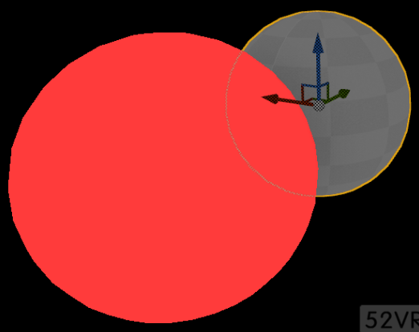
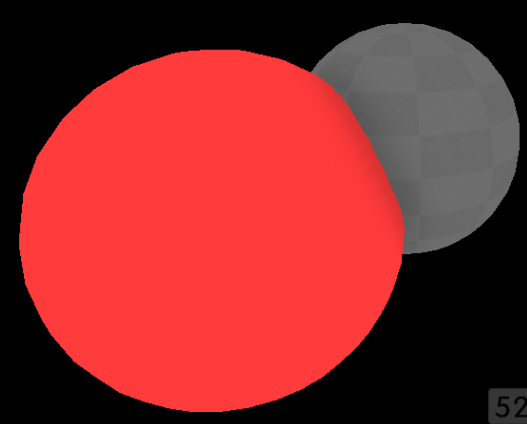
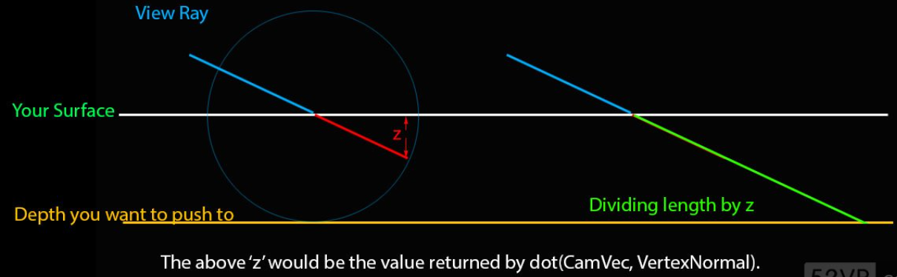
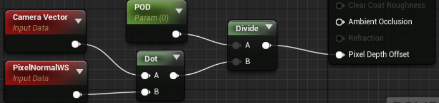
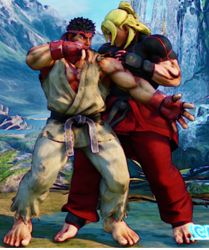
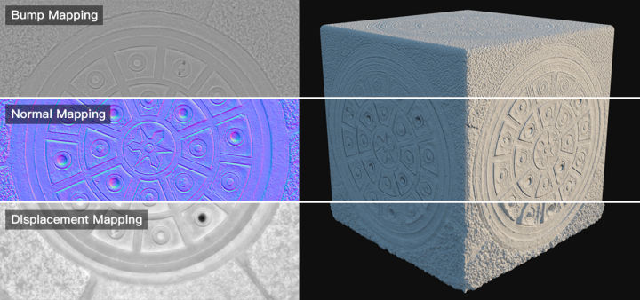
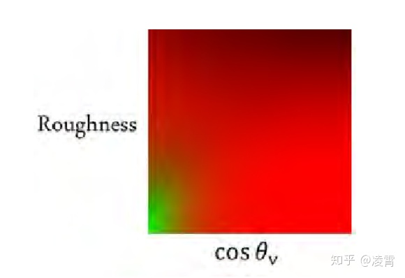
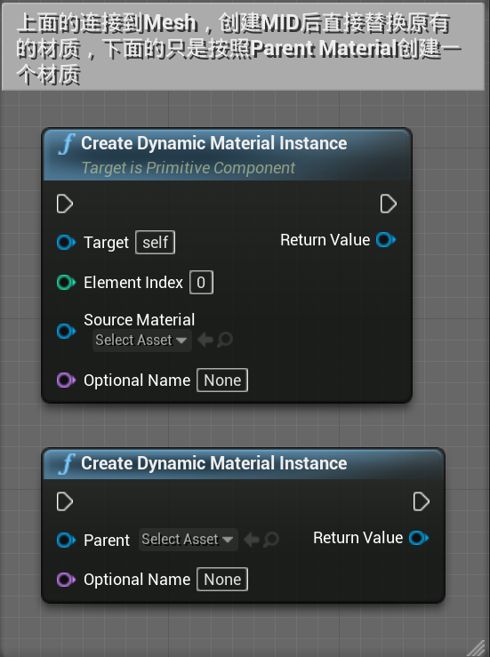
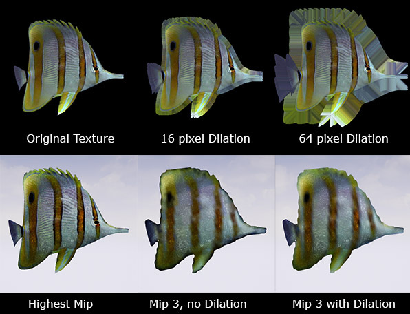

Shader Model 1.0（DirectX8.0）、Shader Model 2.0（DirectX9.0b）、Shader Model 3.0（DirectX9.0c）、Shader Model 4.0（DirectX10）、Shader Model 4.1（DirectX10.1）和Shader Model 5.0（DirectX11）。

### GBuffer

常用的是5纹理GBuffer：GBufferA.rgb = WorldNormal（Alpha通道用PerObjectGBufferData填充）；GBufferB.rgba=Metallic, Specular, Roughness, ShadingModelID; GBufferC.rgb是BaseColor和GBufferA0组合。GBufferD留给自定数据（deferred decal），GBufferE留给预处理的shadow因子。

## 剔除

四种剔除按开销由低到高进行，并构建一张逐模型的可见性列表。

Distance Culling：每个物体都有最大渲染距离属性，也可以用Cull Distance Volume影响整个Volume中的物体

Frustum Culling：视锥剪裁

precomputed Visibility：通过预构建生成，将场景划分为若干网格，摄像机进入网格后可以通过查询网格对应的表知道当前位置哪些物体可见哪些不可见，适用于中小型关卡，适用于低端硬件。

Occlusion Culling（动态遮挡/硬件遮挡查询）：

硬件遮挡剔除首先将遮挡体渲染到深度缓冲，然后创建一个遮挡查询（occlusion query），这一步用硬件深度测试渲染希望查询遮挡情况的模型，返回通过深度测试的像素数量。这一步渲染的是包围盒而不是原模型。然后将查询结果读回CPU，如果返回像素数为0则物体完全被遮挡，不提交模型给GPU渲染。CPU读回数据会延迟一两帧，因此物体可能会突然出现消失。

每个actor粒子通过boundingbox进行遮挡剔除

最后还会通过ShadowFrustomQueries提交针对光源的包围盒遮挡测试 ，如果光源被完全遮挡，则不进行光照和投影计算。PlanarReflectionQueries进行平面反射的遮挡剔除计算。

将若干模型合并成大模型虽然可以在遮挡剔除的时候降低CPU消耗，但很大的模型因为难以被遮挡剔除，因此会增加GPU消耗，且大物件Lightmap精度低。

大型开放世界，遮挡可能没太大作用，而计算遮挡的性能依然消耗了。

**HZB(Hierarchical z pass occlution）**

类似occlusion culling，使用Mip版本（Hi-Z Buffer？）的场景深度RT检查Actor边界，因此会剔除更少对象。仍然需要在Cpu上读取结果。

**软件遮挡查询/软光栅剔除** 

硬件遮挡查询在GPU进行可视性检查，软件遮挡查询在CPU上对场景进行光栅化来剔除Actor。它使用actor的指定LOD来遮挡后面的Actor。在移动平台上软件遮挡是单帧延迟，硬件遮挡查询则是双帧延迟。

使用方法是在project setting中启用软件遮挡，并且在Mesh编辑器中，将LOD for Occluder Mesh设置为0以上的值。可以只在中大型Mesh上做，小的网格体几乎不会成为遮挡物。

CPU不能像GPU一样快进行栅格化，因此这项技术的效率取决于需要栅格化的遮挡物的数量，其在屏幕上的大小，遮挡缓冲区的分辨率等因素

软光栅不支持hism

**Prepass/EarlyZ Pass**

pixel shader如果很重的话，渲染了而被剔除的pixel就很浪费，prepass是在光栅化之后，pixel shader之前预先按照深度进行渲染，可以渲染出一张mask，剔除掉每个物体被别的物体覆盖掉的像素，只渲染最终会出现在画面中的像素，因此是两倍draw call。earlyz是现代GPU硬件的标准流程，排序物体距离，按从前到后的顺序渲染物体，当不透明的图元从光栅化阶段开始逐像素处理后首先进行深度测试，不通过深度测试就不走片元着色器，Alpha Test或者Depth modify都会使early z失效，但对于不会抛弃像素的不透明物体来说earlyz的结果就是正确的。prepass可以配合earlyz使用，earlyz由于需要cpu端的物体排序，当场景非常复杂的时候频繁排序会导致性能下降，渲染prepass的话，earlyz就可以使用prepass的信息。

AlphaTest会让Early Z失效，因为Early Z是发生在片元着色器之前的，alphaTest会通过earlyZ，导致它后面的片元被抛弃，但该片元在片元着色器里通不过alphaTest。因此AlphaTest物体应用early z的方法是在z-prepass中渲染opaque和masked材质，只写深度，先渲染opaque，再渲染mask，渲染masked时候开启discard。第二个正式渲染的pass中将深度测试改为equal，关闭写深度的渲染opaque物体和masked物体，此时不开启discard，但因为用equal深度测试模式，因此masked的像素会正确通过。

[pre-z](https://zhuanlan.zhihu.com/p/81011375)

**HSR（Hidden Surface Removal）**

把着色延迟到所有图元都光栅化完成，得到fragment后，因此彻底解决了overdraw问题。earlyz虽然对物体进行了排序，但不能保证不发生像素遮挡，还是会有overdraw。

有和没有是tbdr（hsr）和tbr（early z)的区别，tbdr里的defer，defer的就是片元着色器。

hsr可以一直开到第一个透明物体或mask物体，然后后面就不开了。

## Shader permutation

Unreal会根据不同用途将一个shader/material编译成多种permutation，当一个Material被修改后，Unreal会去寻找被material使用的.ush/.usf文件，并重新加载它们。接着，Unreal会把这些Material Graph转换成HLSL代码，开始编译shader的Permutation。

由于Unreal使用deferred renderer，所以一些shader是全局的，例如采样GBuffer和计算最终颜色的pass。这也就意味着这些shader不是material的一部分，所以修改这个material并不能导致他们被重新加载。一旦你修改这些global shader，当Unreal重启时，它就会重新编译所有依赖global shader文件的所有shader。

影响变种多寡主要因素包括：材质所勾选的VertexFactoryType个数、和Mesh相关Rendering 的个数（如DepthRendering ,ShadowRendering、BasePassRendering=）、对应Rendering中所蕴含的策略变种（如光照模型、HDR\LDR管线是否分离、是否开启投影、受几个灯影响）、材质(材质实例）静态开关实例化个数。

减少Permutation数量可以减少编译：在材质的细节面板Usage栏里，编辑器会自动设置材质用途，最好用主动勾选代替默认设置。

对编辑器公开的内容

- 质量开关节点( quality switch ），引擎会为其中一个输入的每个版本都生成不同版本的着色器。
- 开关节点( switch ),真假各生成一个版本。
- 特征等级开关（feature level switch），可用于禁用DirectX 10（SM4），从而产生相应的影响。
- 关闭“Allow Static Lighting”，意味着Static Light对你的material没有影响，会减少自动生成的着色器数量。
- 关闭“Support Stationary Skylight”，stationary sky light对你的material没有影响
- 此外setting里有Shader permutation reduction和Targeted rhis设置，禁用那些选项，引擎就会从着色器中剥离某些功能。一般情况下保持默认。

对于Mobile Shader，可以关闭：

- Support Combined Static and CSM Shadowing
- Support Distance Field Shadows
- Support Movable Directional Lights
- Max Movable Point Lights = 0

[Shader permutation及其优化](https://zhuanlan.zhihu.com/p/50912538)

## Material

**通识**

UE material的节点连接部分自定义albedo specular uv等信息的获得算法，最后的输出节点是用albedo specular等信息进行deferred管线通用渲染，包括光照计算等。

相比传统引擎中的Material大多是三层结构(Material ->FeatureLevel -> Passes），UE4舍弃了其中的Passes部分。坏处是传统工艺中依赖MutiplePass的效果在UE中实现大多需要修改引擎。

UE4的材质编辑器回避了Shader着色阶段选择问题，其生成的Shader大部分工作在PixelShader(或GL的FragmentShader)阶段，好处同样是足够简单，坏处是容易被滥用

看material的shader源码：material editor>window>shader code>HLSL code

Engine内容的Engine Volumes里有深度雾、light beam等等材质

### Custom Node

可以在MaterialTemplate里include我们自己的usf文件，就可以在CustomNode调用

**pixel depth offset**

代表的是将这个像素的深度沿着摄像机到该像素的方向往后推一个值。

注意，如果将其设定为一个固定的值，则往往会出现V向量与N向量的夹角越大，平面向后推的像素深度越小的情况。

解决方法是这样设置：

这样能够将一个面一起推后一个距离，而不会出现一个面上的不同像素推后距离不同的情况。

实际应用：

### 半透明

https://developer.oculus.com/blog/translucent-vs-masked-rendering-in-real-time-applications/?locale=es_LA

通过配置r.SeparateTranslucencyScreenPercentage降低半透物体分辨率。部分需要高分辨率的透明材质可以转换为Mask材质，通过TAA抖动模拟单层半透明。用半透明可以高效代替全屏后处理。

**半透明特性**

能和材质后像素混合的材质都是透明材质，因此其他如Modulate, Additive, 以及AlphaComposition 等混合模式的材质都具有透明材质的特征。

半透明不写入场景深度（SceneDepth），但可以单独绘制深度到Custom Depth，及绘制Custom Stencil等buffer；

深度相关的特性缺失，最常遇到的问题是基于像素的前后排序的问题。目前透明材质的前后排序仅能通过透明物体相对于摄像机距离远近来做前后排序，这个可以在物体的Translucent sort里设置其优先级，优先级越高越靠前。也可以把这些透明物体作为一个Group通过使用一个Bounds来固定前后绘制顺序；但所有这些都基于物体而非像素。可以通过忽略排序来让它绘制到最前面（材质中Disable Depth Test）。

**半透明和延迟贴花区别**

半透明材质只能拿到GBuffer信息，无法写入,Deferred Decal可以更新GBuffer(没有Depth)，因此延迟贴花可以在计算灯光前改变材质normal、Roughness等属性,非透明材质只能完全覆盖所有材质属性，而无法单独写入个别材质属性到GBuffer，延迟贴花可以据此做一些附加在角色身上的buff，褶皱和变形等效果，或者区域的干湿变化。可以方便的跨越多个物体的多个材质，或一个材质的部分区域，方便维护。

https://www.unrealengine.com/zh-CN/tech-blog/understanding-and-application-of-transparent-materials-in-ue4

**World displacement、World position offset**

这两个都可以对平面进行offset 产生立体效果，区别是：displacement让你在ue4里自己进行曲面细分并进行位移，而world position offset是对于顶点进行的offset，因此导入到ue4时就要是一个顶点数很多的精细网格。用displacement可能能对不同计算水平的硬件做更好的适配。

world position offset的最常用用法是让草随风摆动。为草面片刷上一些vertex color，比如从下到上从黑到绿，然后按绿色程度控制world position offset

## 纹理

frac有精度问题，要平铺可以通过设置纹理WrapMode。

不是2的幂的 纹理没有MipMap

**纹理预算**

引擎在计算机内存中为纹理保留一定量的空间，即所谓的纹理预算。这些空间保留在内存中，被称为TextureStreamingPool（纹理流送池）。r.Streaming.PoolSize可控制标准纹理流送池的大小，纹理流送池不够时，部分材质会出现非常模糊的纹理（引擎采用了较低分辨率的mipmap。）

每个材质拥有16张贴图采样的纹理限制。其中部分采样器供内部步骤使用，例如光照贴图阴影贴图等，所以大约有13个纹理可使用。

**纹理属性和压缩**

纹理压缩主要解决内存和带宽的问题。

bmp、tga、png、jpg等压缩是基于整幅图片的压缩，比如霍夫曼编码等，像素和像素间在解码过程中存在依赖关系，无法直接实现单个像素级别的解析，发挥不了显卡的并发能力。且png和jpg虽然文件大小不一样，但在显存中解码后都是RGBA格式，显存的占用率是一样的。

游戏纹理压缩对应的算法是以某种形式的固定速率有损向量量化将固定大小的像素块编码进固定大小的字节块中。png、jpg等压缩格式尽管压缩率很高，但不支持像素随机访问，不适合gpu，DXT,ETC等纹理压缩方式可以在游戏运行中无需CPU解压就被GPU直接采样。

**向量量化(Vector quantization, VQ)**是一种量化技术，将一组大量的点(向量)分成具有近似相同数量的最接近它们的点的组。每个组用它的质心点表示，因此存在数据误差，适用于有损压缩。放到纹理压缩中来理解，就是例如将4x4块像素的颜色以2个基色来表示。

**压缩比**：通常以比特率或每像素的平均比特数(bits per pixel, bpp)表示，常见的为2~8bpp。一般RGB原生纹理的像素指24位，4bpp表示每像素占4位，所以也可以认为4bpp表示压缩比为6:1

在不同移动GPU平台下选择GPU支持的压缩纹理，就可以在不需要CPU解压的情况下直接被GPU采样，节省CPU内存和带宽，也可以节省存储的体积。如果目标平台不支持设置的压缩格式，纹理将解压为RGBA32或者RGB24，浪费CPU时间和内存。

\- DXT：微软directX支持的有损压缩算法，基本所有pc端显卡都支持。DXT1和DXT5较常见。

\- ETC：Android端常用

sRGB：standard RGB空间，用于显示器和打印机的标准rgb色彩空间，gamma校准系数为2.2。光照计算应当在Gamma系数为1的线性空间中进行。

**Unreal纹理属性设置**

BaseColor：default（BC1/3)，勾选sRGB，如果不需要Alpha可以勾选Compress without Alpha

Normal：NormalMap(BC5)，不勾选sRGB，也可以勾选 without alph

Metallic/Roughness/Specular/AO：Mask（DXT5（BC3）），不勾选sRGB，BC3的话把4个通道里比较重要的那个放在Alpha里

Alpha/GrayScale/Heightmap：Mask/GrayScale

HDR:HDR(BC6）

单通道贴图：Alpha或GrayScale(GrayScale相当于不压缩，使用G8，因此适合不是很大的贴图，比较大还是用Alpha，BC4压缩一下)

特别重要的：使用BC7

https://zhuanlan.zhihu.com/p/357882835

**Nodes**

**类型**

- 内置输入节点：红色，可能来源于前一Shader阶段的输出数据或引擎内置的UniformParameter（如Time）
- 内置函数和运算符节点：可能来源于HLSL原生函数或引擎usf中定义的标准函数
- 常数和参数节点，static节点
- FeatureLevelSwitch和QualitySwitch节点 

常用组合见effect仓库

**Transform**

transform position是对点变换，transform vector是对向量变换坐标系，只旋转，不缩放和平移

**Lerps**

if(Alpha==0) ReturnValue=A if(Alpha==1) ReturnValue=B else return k*(B-A)+A

**Smoothstep**

if(Alpha<0) ReturnValue=0 if(Alpha>1) ReturnValue=1 else {    x = clamp(Alpha);    ReturnValue=3x^2-2x^3; }

**Pivot_painter**

植物或instance Mesh可能不能使用object orientation这个节点（？），可以用pivot_painter解决一些问题：baking vertex direction into vertex colors。比如对于一簇草模型，在对草进行风场等弯折效果的时候，希望每根草按自己的pivot弯折。因此在3DMax，houdini等工具中，可以通过pivot painter设置每根草的pivot，并将pivot位置、pivot up vector烘焙到2套uv。

## Shading

**游戏常用贴图类型**

- 颜色贴图

- - Diffuse/Albedo/Base Color：传统工作流（兰伯特着色器）中Diffuse Map是带着光影信息的，PBR工作流中没有
  - Gradient Map/ColorLUT(颜色查找表）:将一种颜色映射到另一种颜色，可控制漫反射光照，进行风格化渲染，或用于SSS优化复杂光照的渲染，如皮肤、毛发等

- 凹凸贴图

- - Bump/Normal/Displacement:Displacement有时用于改变模型的顶点位置（作为Parallax视差贴图使用），而Bump和Normal则不会改变模型的顶点位置。Bump≈高度图，通常与法线贴图结合使用，用于给出表面凹凸的额外信息（只有高度信息的话不能表示边缘向哪里玩去，所以边缘是无法平滑柔化的，而法线信息只包含角度信息，不包含高度信息）。就实现复杂度/质量与性能开销而言，Dispalcement>Normal>Bump.
  - 使用法线贴图的话需要原始切线数据

- 反射贴图

- - Metallic/Roughness/Specular
  - Anisotropic Map：各向异性贴图，如可以表现拉丝金属的表面微划痕产生的各向异性高光效果。

- 结构贴图

- - AO
  - Bent Normal Map（环境法线贴图）有助于减少照明构建之后发生的漏光现象，和AO图结合使用以改善漫反射间接照明
  - Thickness：记录表面厚度信息，辅助制作SSS材质

- 数据贴图

- - Flow Map：存储向量昌数据，可以制作流动的水面效果
  - Mat Cap（Material Capture）：将某种固定光照条件下，从某个特定方向，特定角度的光照效果直接记录在贴图上，运行时将法线变换到View空间，其xy分量从（-1,1）变换到（0,1)，作为UV进行采样MatCap，实现极低成本的PBR效果（有高光和反射信息）。只要摄像机角度不动，光照角度不动，角色可以随便动。
  - ILM贴图：卡通渲染使用的手绘贴图，保存高光强度、阴影Threshold等信息

### PBR

4.25更新了ClearCoat，可以更好的制作手机外壳、车漆、玻璃珠等透明外壳材质，并且可以通过控制第二法线，增添更多细节。

blinn phong power to roughness：高光power转roughness ： 2/roughness^4 - 2

间接照明（IBL?)由漫反射和高光反射部分组成，与直接光照不同，需要对pbr公式进行积分，积分拆成漫反射和高光两部分计算，用三张图表示。漫反射部分可以使用Irradiance environment map，取代写死的Ambient Light。高光反射部分使用ibl，高光的特点是根据roughness和视点方向不同，结果不同。

粗糙度不同时表面接收光照的范围也不同，粗糙度很低的镜面主要接受单一方向光线，粗糙度很高的表面则接受很大范围的光线，IBL的辐射率积分通过重要性采样进行，突出采样贡献最大的，但即便使用重要性采样，还是需要很多采样数。通过分解求和近似-Split Sum Approximation，可以将积分公式拆成两个求和部分，分别对每个部分进行预计算，存储成贴图（预积分环境贴图-Pre-Filtered Environment Map）。第一个部分:预积分环境贴图,有五层mipmap(mipmap是一种硬件filtering，生成mipmap的时候自动就会对周围像素取平均），根据roughness决定采样哪层，也就获得了不同的辐照度信息。第二部分Environment BRDF，保存一张这样的查找表，输入roughness、视线cosθ，输出环境BRDF镜面反射在光色为白色时的强度。制作这张贴图的函数叫IntegrateBRDF

根据https://zhuanlan.zhihu.com/p/70286099所说，移动端的EnvironmentBRDF使用简单方式进行模拟：

当存在Lightmap的时候，使用 BRDF = Lightmap的亮度

当存在PointLIghtIndirectCache的时候，BRDF = PointLihgtIndirect的亮度

当以上两者都不存在的时候，使用 BRDF = 1

故最终的移动端IBL贡献计算为：IBL = SamplerCube(Cubemap ,Roughness ) * BRDF * MaterialAO

Realtime rendering in ue4：https://zhuanlan.zhihu.com/p/121719442

深入理解 PBR/基于图像照明 (IBL) - Ubp.ahttps://zhuanlan.zhihu.com/p/66518450

**Mobile PBR**

和PC端的PBR公式不一样，移动端的BRDF是（roughness*0.25+0.25）*D，即F和G两项用Roughness的线性函数来近似。

**

### Shading Model

控制材质反射入射光线的方式，不同的Shading Model有不同的输入。

**Unlit**

适用于火焰或者照明物，但Emissive的辉光效果不会投射光线或阴影。

**DefaultLit**

使用直接和间接光照以及反射高光

**Subsurface**

能够模拟次表面散射效果，光线会穿透表面，然后在整个物体中弥散。这种现象在冰、蜡烛、皮肤等对象上最容易出现。Subsurface Color输入是物体表面下物质的颜色。对人类皮肤而言，深红色效果通常不错。

**Pre-integrated Skin**

类似次表面，适用于人类角色的低性能开销皮肤渲染

**Clear Coat**

模拟标准材质表面有一层半透明薄膜的多层材质，比如丙烯酸或喷漆透明涂层，以及苏打罐和汽车漆等金属表面的彩色薄膜。

透明涂层着色模型（Clear Coat Shading Model）还可以为透明涂层下的表面添加第二法线贴图。这样材质能够更精确地为复杂材质建模，例如碳纤维和车漆，这些材质的几何或反射表面与透明涂层不同。

**Subsurface Profile**

类似Subsurface和Pre-integrated Skin，高级皮肤

**Two Side Foliage**

双面植被允许光线穿透材质表面,次表面颜色用于定义光线穿透量，同时用于为叶片茎脉等部分创建遮罩。

**Hair**

模拟多种高光：一种代表光线的颜色，另一种代表毛发和光线的混合色

**Blend Mode**

**半透明**

半透明物体只支持静态阴影。

**Material Instance**

大型游戏通常有20-50个master材质，按照如这样的层级管理，植被master材质->灌木子材质->各种具体灌木子材质。通常工作流会在大量使用MI和大量使用material layer中二选一。

**Domain**

Volumetric

粒子系统使用domain设为体积的材质会将粒子渲染为体积雾。可以使用一个足够大的粒子覆盖整个体积范围，

## Virtual Texture
### RVT（运行时虚拟纹理）

**key**:2012年的技术，几乎没有用在手机上，因为手机带宽不够可能导致一些问题。使用CPU+内存解救GPU的技术。常用于大地形绘制。

比如有一个8k*8k的地形，不能一次性加载进内存，在内存中创建一个1K*1k的虚拟纹理，这张纹理上有若干Tile（Tile 有若干Lod尺寸），并配了一个look up table（LUT按Tile的最小lod尺寸索引，比如Tile最大lod尺寸为128*128，最小Lod尺寸为16*16，则LUT是一个64*64的表，每个元素保存某个地形块在VT中的位置（UVOffset））。

VT的工作流是，当视点不变时，只执行Pass B，采样3次左右。当视点改变时，需要将新的块加载进VT，执行Pass A后执行Pass B。当一个块不在视点中很久时，标记该块过时，后面的Tile可以blit到这个位置，覆盖它。

PassA：vertex shader后 ，一个地形块上可能有多个材质层，如石头上有青苔、泥土、雪等，将所有材质及其lightmap、reflection cube等贴图采样并烘焙成一个Tile并blit到VT上

PassB: vertex shader后 ，从LUT采样一次，从VT中采样Base Color和Normal（specular和roughness可能写进baseColor和Normal的alpha通道）渲染

传统工作流：vertex shader后 执行pixel shader，每帧都要执行对多个material layer的base color和normal采样，对于4个材质层的地形，是8次以上的采样。这个采样是固定的，为什么每帧都去采样呢，但如果将大地图全部烘焙保存在内存里，又承受不了内存开销，因此采用了类似虚拟内存的这样的技术，让视野中的块换入换出。

### SVT

RVT和SVT加载方式类似，都是以tile方式加载SVT作为asset是存在硬盘上的；RVT是当你在Run Time时会进行一个生成和渲染

**UV Dilation**

UV Dilatoin可以防止在较低的MipMap中出现EdgeBleeding

https://shaderbits.com/blog/uv-dilation

## 抗锯齿

TAA可能导致抖动。因为是通过抖动画面并取平均进行模糊的。

MSAA只能在前向渲染使用。

Composite Texture功能可以通过增强法线转折处的Roughness，减小高光反射，从而减弱高光锯齿。该功能没有额外开销。

## Reflection

反射是间接光的高光，或者高光的GI。高光GI缺少阴影表现为反射漏光。反射对pbr效果非常重要。

### Reflection Capture

提供环境反射，只有间接高光且不包含漫反射。UE4在移动端的标准光照模型中SkyLight Cubemap和Reflection Capture Cubemap是互斥的（因为RGBM Encode的原因），且在选择时Relfection Capture的优先级高于Skylight，导致永远只可能Reflection Capture有效。移动端的Relfection Capture的范围也无效，物体在渲染时只取离它最近的那一个，也导致在场景制作过程中，需要区分室内室外，楼上楼下，多变的环境氛围时工作流几乎不可能实现，因为无法精确控制范围。

使用反射捕捉时，引擎会将反射捕捉的间接镜面反射与光照贴图的间接漫反射混合在一起。这有助于减少泄漏，因为反射立方体贴图仅在空间的一个点处捕获，但是光照贴图是在所有接收器表面上计算的，并且包含局部阴影。混合对于粗糙的表面效果很好，但是对于平滑的表面，Reflection Captures的反射与屏幕空间反射或平面反射等反射结果不能匹配，因此不能在光滑表面上进行光照贴图混合。

粗糙度为.3的曲面将得到完全的光照贴图混合，而粗糙度为.1或更低时，淡化为没有光照贴图混合。这样可以使Reflection Captures和SSR更好地匹配，并且很难发现过渡。开启reduce lightmap mixing on smooth surfaces选项可减少光滑平面的lightmap混合。

**Reflection capture actor**

是Static的，在building light的时候生成mipmap cubemap，只能反射静态的物体，运行时性能开销不大，但如果重叠很严重的话就会产生严重的overdraw，因为unreal会在多个reflection capture actor中间混合。另外半径越大开销可能会越大。半径小的优先级高于半径大的。

[UE4移动端预览模式下Reflection Capture调整后变黑问题](https://blog.csdn.net/StraightenupRyan/article/details/105241397)

[recapture优化](https://zhuanlan.zhihu.com/p/138078907)

### SSR

Basic SSR是Ray tracing算法，对于要反射的每一个像素，计算反射光线，然后在DepthBuffer中沿着反射光线方向进行trace，取交点处的颜色作为反射颜色。

SSR等需要开启高精度法线以减少拉伸。

手机上没有GBuffer的Normal，用不了SSR，新出的是SSPR

Unreal里面的反射效果有多种产生途径，比如设置roughness，比如把material的lighting mode设置为surface translucencyVolume。

planar reflection开销很大，效果很好。Screen Space Reflection比 planar好一点，但也贵，并且SSR只在后处理阶段在屏幕空间做，侧着看会效果不对，所以不适合用在镜子等上面，但是用在地板之类的地方效果不错。通常需要结合reflection actor和SSR等技术来产生反射效果。将多个立方体贴图进行混合的反射方法可能会导致反射中有重影，可以使用细节法线贴图、粗糙度等设置打破反射。

## 粒子系统

粒子效果单独渲染到一个Render Target上。

GPU粒子可以支持Depth Buffer Collision，但是只有translucent支持，[mobile不支持gpu sprite碰撞](https://docs.unrealengine.com/en-US/RenderingAndGraphics/ParticleSystems/Reference/TypeData/GPUSprites/index.html)

## 后处理

首先以HDR渲染场景，然后根据颜色直方图和EyeAdaption、SceneColorTInt等设置，tonemapper将HDR颜色映射为LDR颜色，然后color grading是把一种LDR颜色映射为另一种LDR颜色

TAA（使用History Buffer和Velocity Buffer）、运动模糊、自动曝光（计算场景亮度直方图，计算每个亮度区间内有多少像素，相应调整曝光

Bloom：为超过阈值的颜色区域添加高斯模糊，产生泛光

Tonemapping：这一步骤可以为不支持HDR的设备进行色调映射。UE支持mobileHDR渲染，但不支持HDR Color Buffer，无法进行Mobile HDR输出。

SceneColor.w保存msaa后的depth

一般postProcessMaterial都是在tonemapping之后，因为之前是HDR，更加浪费带宽。HDR是一个像素32位（8bytes的），LDR是16位（4bytes）

ppv的混合经测试，可以混合后处理参数，但是ppv material只能在两个父材质相同的材质实例中间混合，嵌套ppv的情况，如果外面使用了Material，里面不使用material也无法取消Material的效果。
