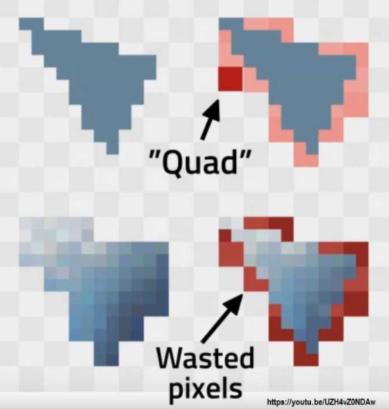
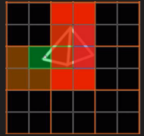
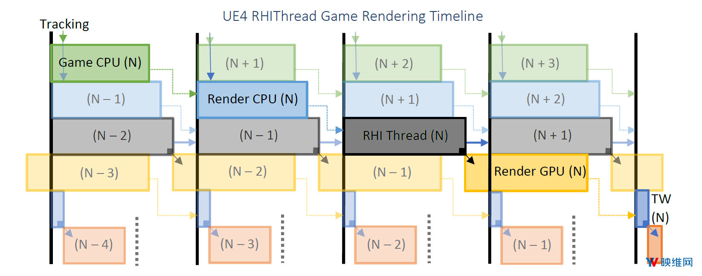
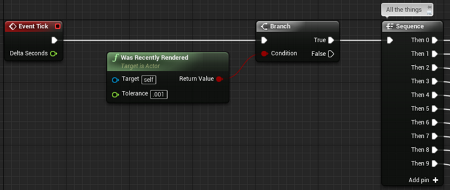

## 优化技术

### Profile

注意最好不要在Debug版本下进行性能分析，可以在Development版本做，Shipping下实际性能会更快，最好是在Shipping下做，但需要一些代码功能被打开。

Frame时间是生成游戏中一帧所需要的时间，GPU时间与帧同步，通常与帧时间相近。如果Frame时间与Game时间非常相近，则瓶颈是游戏线程，如果Frame时间与Draw时间非常相近，则瓶颈是渲染线程。如果两者都与GPU时间不怎么接近，则瓶颈是显卡。

**stat unit/stat unitGraph(stat unit带可视化）**

Frame、Game、RHI、Render Thread时间

**stat Engine**

总体渲染stat，比如frameTime 和三角形数量

**stat startfile/stat stopfile**

在路径Saved/Profiling/UnrealStats下会有stats文件，在窗口中打开Session Frontend，切换到Profiler，选择载入最近捕获的ue4stats分析文件

**Stat InitViews**

剔除相关，遮挡计算的耗时和多少个物件被遮挡

**stat RHI**

可以看DrawCall（Draw Primitive Calls）和三角形面片数，和各种显存占用

**stat gpu**

basePass：三角形数、shader开销

- Drawcalls: How many drawcalls the GPU has to do for each frame.
- Overall: The total render time including all renderpasses.
- Prepass: In the prepass, the UE is sorting the instances based on their distance to the camera. (DBuffer)
- Basepass: Runs through the shaders (materials) to create the GBuffers.
- Shadow: Combination of all shadow-related passes (ShadowDepths, Lights, LightComposition, etc.)

**stat scenerendering**

mesh drawcall

**stat ShadowRendering**

阴影计算时间，与实际阴影渲染时间分开（已经包含在stat lightRendering中）

**stat LightRendering**

**stat Particles**

**stat Streaming/stat StreamingDetails**

光照图、静态纹理、动态纹理等纹理流送情况

**profileGPU**

可以查看每个Material的开销（截止19年11月只work在PC上），类似Unity FrameDebugger

**ShowFlag**

1. 分别查看每部分开销：

ShowFlag.

- StaticMeshes
- SkeletalMeshes
- Particles
- Lighting
- Translucency
- ReflectionEnvironment
- InstancedStaticMeshes
- LightComplexity(非静态光的影响）
- Bloom
- AmbientOcclustion
- AmbientCubemap
- AntiAliasing

2. DebugView：

ShowFlag.

- Bounds
- CameraFrustums
- Bones
- AtomosphericFog

**其他控制台Profile命令**

- r.SetRes  改变屏幕，或窗口的分辨率。
- r.VSync  开启/关闭垂直同步（可能依赖于是否原生全屏）。
- r.ScreenPercentage  用于减小内部实际渲染分辨率，画面会在重新放大。
- r.meshdrawcommands.dynamicInstancing可以开关instance	
- Freezerendering 查看遮挡剔除。
- r.AllowOcclusionQueries  用于禁用遮挡（可以让场景运行的更慢）。
- r.TiledDeferredShading  能够关闭基于 Tile 的延迟光照技术（GPU粒子的光影则没有退回方法）。
- r.TiledDeferredShading.MinimumCount  能够调整使用多少灯光应用在基于 Tile 的延迟光照技术（视觉上并没有差异但性能会有不同）。
- Pause  暂停游戏或者 Matinee（分析时更加稳定，但禁用了 Update/Tick）。
- Slomo  能够对游戏进行加速或者减速播放。
- r.VisualizeOccludedPrimitives  显示被裁剪掉的物件的外盒框。
- StartFPSChart StopFPSChart  请看下文。
- r.SeparateTranslucency  这是一个用于修复半透明情况下景深的问题的功能，如果不需要的时候可以把它关闭，并有其他影响（查阅 SceneColor）。
- r.Tonemapper.GrainQuantization  用于关闭在 Tonemapper 中添加的噪点来避免 Color Banding，由于 8bit 量化和较小的质量改进在输出为 10:10:10 并不必须。
- r.SceneColorFormat  能够选用不同的 SceneColor 格式（默认是 64bit 的最佳质量，并支持屏幕空间子表面散射）。
- FX.AllowGPUSorting  禁用粒子排序（在大量粒子的使用可以妥协使用）。
- FX.FreezeParticleSimulation  禁止粒子的更新。
- r.SSR.MaxRoughness  调整屏幕空间反射（SSR）粗造度的最大值，并覆盖后处理中的该设置。请查阅 Show Flag VisualizeSSR。

[UE4性能优化操作手册(Version1.0)](https://zhuanlan.zhihu.com/p/54284627)

**Debug Draw**

Draw Debug Box画包围盒

**Material stat**

texture look ups是用到多少张纹理，sampler是同一张纹理算一个sampler

#### 竞品渲染分析

竞品渲染分析主要挑选1-2款同类型差别不大的游戏，进行测试，以天堂2手游为例，同样使用虚幻4进行开发，且同样为TopDown视角刷怪RPG游戏，挑选一些场景，使用截帧工具，例如高通平台可以使用Snapdragon Profiler，主要验证目标为：

1）目标场景总Prims和DC控制数据；

2）纹理尺寸和贴图数量；

3）所启用的一些特殊效果；

4）竞品的设置内容以及低中高三个效果。

从以上目标找到以下答案：

1）游戏中的资源分配，角色、场景、特效、UI、后期、静态网格等开销数据；

2）品质和性能平衡，在不同挡位机器上对品质和性能的权衡（不同级别对应多少的游戏元素的使用情况）。

### QuadOverDraw(overShading）

多数情况下GPU是以Quad为单位进行操作而不是单个像素；那么，比如渲染一个Quad，但其中只有一个像素有效，另外三个都被clip掉了（如植被中被mask掉的边缘），那么渲染这样的Quad性价比就不会很高了；这就是为何小物件过多会占用很多GPU资源；因此在QuadOverDaw界面可以看到半透明物体一般都是黄色往上，距离越远，越狭小的三角形面片渲染速度也越慢，因为多边形数量没有变，密度变大了（因此要开距离剔除）。片元着色器越复杂，Over shading的损耗就越大，前向渲染的over shading 损影响比延迟着色更大。LOD和剔除可以解决这个问题。

两个三角形实际上只影响五个像素，但因为以Quad为单位计算，就造成红色区域被重复计算两次:

### Drawcall

是一组共享相同材质，有相同渲染状态的多边形。

在模型和纹理数据传输到显存，并且设置了正确的渲染状态之后，CPU需要调用渲染API函数通知GPU去执行绘制操作。DrawCall过多其实卡的是CPU，原因是CPU需要通过对渲染api的调用来驱动GPU做事情，1个Drawcall背后是一堆渲染api的调用（设置shader、创建buffer等）

drawcall和instancing、剔除密切相关。

ue4尚且不支持dynamic drawcall batching，需要通过merge actor手动进行

Drawcall评估:

- PC & console games
- - 2000~3000 is ideal 
  - 5000~ starts to have promlems
  - 10000~ probably is a problem
- Mobile & VR games
- - Max is a few handreds

### Game Thread、Render Thread、RHI

它将图形API（Opengl|Vulkan等）调用的实际提交与Render Thread完成的其他工作（如剔除和排序等等）分开。ue中渲染api的调用会放在一个单独的线程叫做RHI线程，专门负责渲染指令的提交，即调用显卡的API。渲染提交的卡顿主要就在RHI线程。但RHI线程不是单独存在的，需要game、render、GPU线程协作，rhi的卡顿也可能是别的线程的卡顿。

几个thread特点如下：

- game thread最多可以等渲染一帧，如果第n帧的渲染在第n+1帧的game tick结束时还没有完成，渲染就会把game卡住，render和rhi不会有延迟
- game驱动render和rhi，因此game卡顿会卡住渲染
- render产生drawcall，rhi提交drawcall，render卡顿也会卡住rhi
- 渲染的最后一步要swapbuffer，即等待gpu完成，所以gpu卡顿也会卡住rhi
- game提交给渲染任务的时机会影响渲染工作的密度，也会影响到渲染的时间，小量多次会浪费渲染效率

总结下来，rhi的卡顿可能来源于：

- 过多的drawcall，过多的渲染状态切换和渲染资源创建
- game、render 、gpu的卡顿

对于game和render线程可以通过查看stat的执行时间来判断（stat rhi），排除是rhi除了问题，对于GPU的卡顿，ue的status中在rhi线程上会统计swapbuffer的时间，如果这个时间过长，就是gpu瓶颈了。

如果是rhi本身的卡顿瓶颈，ue自带的stat工具通常不能给出有力的分析结果，自带的方法只能统计一帧在rhi上做集中给定操作的时间。

### 性能优化设置

**减少片元数**

- 从前往后绘制物体，减少Overdraw
- 慎用实时光照
- 通常用半透明材质比post process要省，因为post process里需要对纹理进行采样，而在材质里取scene depth是直接从数据结构里拿（gl_lastFragColor,是FGBufferData？），无需采样纹理。半透明可以用Mask+TAA模拟
- 即使完全透明的游戏对象也会用到渲染绘制调用。为避免这些调用浪费，可设置引擎停止对它们的渲染。

**减少顶点数**

- LOD 
- 剔除
- 减少uv不相同的顶点，避免顶点被拆开
- FOV，视锥体大小影响可视物体数量

**减少计算复杂度**

- 半透明材质都应尽可能保持简单。（会针对存在的每个半透明层反复重新计算每个像素，从而快速提升计算次数，并且难以理清半透明表面的排序顺序。）
- ShaderLOD技术
- 所有材质应基于贴图（例如材质里面生成噪点纹理会比噪点贴图消耗很多很多。
- 高精度计算可以使用查找表（LUT）或者转移到顶点着色器中进行处理
- 避免sin、tan、pow、log等较为复杂的数学计算
- 将CPU工作转给GPU：将旋转或移动物体放在world Position Offset执行
- 将PixelShader的工作转给VS：用vertexInterpolator节点（但注意随着观察距离变远，像素着色器的调用次数逐渐减少，vs调用次数却不变）
- 除了静态光，其他光源尽量避免重叠

**控制带宽**

- 减少渲染分辨率

**减少计算量**

- 在远距离关闭动画、特效和world position offset

- 优化Shader permutation数

- 可选的关闭Mobile Shader Permutation Reduction和allow static lighting

- 使用vertexInterpolator和customUV

**减少draw call**

- 用custom primitive data减少draw call

- 高分辨率的纹理也会使drawcall变贵

**剔除**

- 要开启距离剔除，使用Precomputed Visibility Volumes，场景中如果有10000-15000以上的物体就会在剔除阶段有较大开销。

- 使用cullDistanceVolume，指定比如所有包围盒大小50以内的物体，在距离 为1000时都剔除掉。

- grassType文件里设置植被的start和end cull distance

- 通过bulk edit property功能可以批量修改模型的属性

- project settings中的early z-pass可以设置为opaque和masked meshes并且打开mask material only in early z pass

**阴影**

- 减小Dynamic shadow distance，减小cascade层级数

**Material**

- 禁用Lightmap directionality

- fully rough

- 禁用Full precision
- 禁用high quality reflections

- 禁用Dithered LOD Transitions

**蓝图调用优化**

- 可在 Event Tick 开始时添加“是否最近进行渲染”(Was Recently Rendered) 检查。这样，我们无需再关联自定义时间和侦听器来进行“tick”的开关，系统仍可独立于场景中的其他 Actor。

- 通过 Set Actor Tick Interval 节点减慢其tick速度并只允许每一时间间隔只“tick”一次，或修改Details 选项卡中的 Tick Interval

### Mobile

[各平台支持效果](https://docs.unrealengine.com/zh-CN/RenderingAndGraphics/SupportedRenderingFeatures/index.html)

[移动平台材质优化与故障排除](http://ue4.su/ru/Platforms/Mobile/Materials/index.html)

[移动端画面效果适配](https://www.unrealengine.com/zh-CN/tech-blog/visual-effect-adaption-of-ue4-mobile-project)

[移动端效果优化](https://docs.unrealengine.com/en-US/SharingAndReleasing/Mobile/Performance/index.html)

**mobile端限制和简化**

离屏渲染:先渲染到分辨率低的rt上，在upsample到手机分辨率的backbuffer

[UE高级性能剖析技术（1）-- RHI线程（渲染提交)](https://blog.csdn.net/leonwei/article/details/95527109)

只能使用16个纹理采样器

只有默认和无光照的着色模型可用。

Translucent and Masked很贵

以下不可用：

Scene Color 表达式

Tessellation

Subsurface Scattering

移动平台后处理需要在项目设置中开启：Mobile HDR

Mobile纹理的压缩设置建议仅使用 TC_Default 或 TC_NormalMap

移动平台网格顶点数和骨骼数有限制。

**Android联机调试**

4.24以前要安装nvpack，4.25以后要安装android studio。需要确保项目设置里的android sdk等路径正确配置，cmd 里通过adb devices命令可以检测到自己手机。

然后两种方式：

\- 在Launch里打开project launcher，launch相应平台。

\- 或者在file->package里选择相应平台进行打包，并在生成的文件中通过install.bat安装（不要通过apk直接安装！）

四指触屏出命令台

[Performance Optimization for Environments | Inside Unreal](https://www.youtube.com/watch?v=ZRaeiVAM4LI):

15分左右：通过蓝图在场景中设置一条路线或者多个相机位置，通过stat startfile/stopfile等命令记录得到一个分析文件

### 工具链接

官方文档命令大全

https://docs.unrealengine.com/en-US/ProgrammingAndScripting/Rendering/Overview/index.html